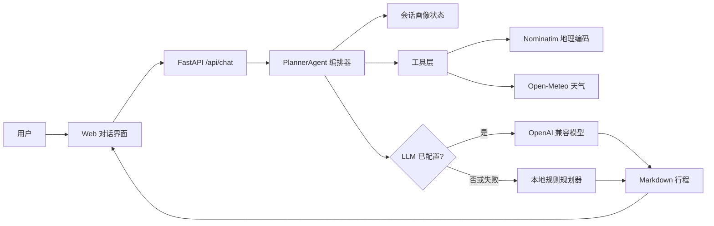
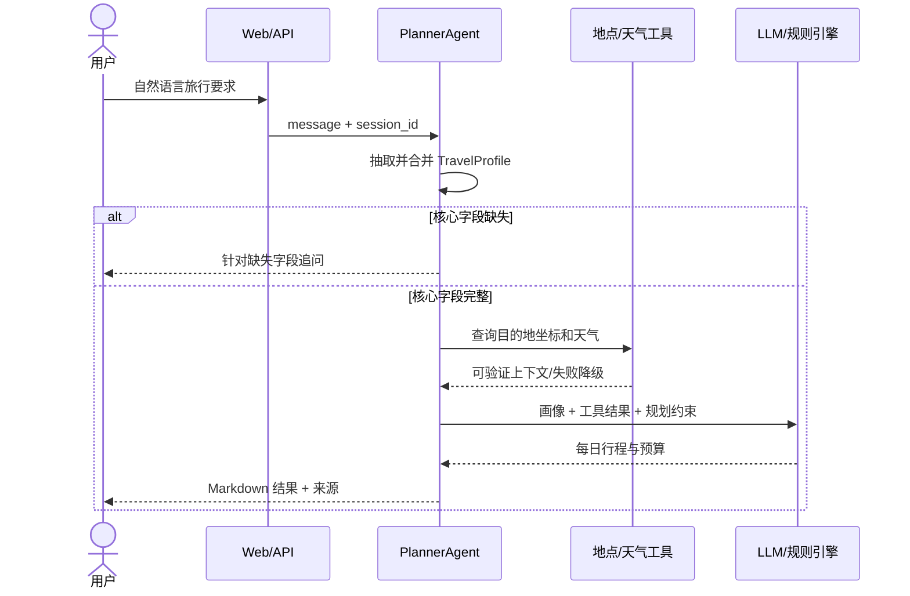

# 系统架构说明

## 总体架构



## Agent 交互流程



## 数据模型

核心状态 `TravelProfile` 包含目的地、天数、预算、人数、偏好、出发地和日期。服务端只按 `session_id` 保存结构化画像，不依赖完整对话历史，从而降低提示词长度并减少旧信息干扰。

## 关键设计决定

- 先结构化、后规划：缺少目的地、天数、预算或偏好时不生成伪精确行程。
- 工具失败可降级：网络服务或模型失败时，返回明确标注的规则化行程骨架。
- 预算守恒：分项预算由总预算按固定比例拆分，尾差进入机动金。
- 实时事实有边界：模型只能把工具结果作为实时依据，未知营业状态与票价必须提示复核。
- API Key 仅从环境变量读取，`.env` 被 Git 忽略。

## API Spec

### `POST /api/chat`

请求：

```json
{"message": "两人去杭州3天，预算5000元，喜欢自然和人文", "session_id": null}
```

响应包含 `session_id`、`reply`、状态 `collecting|complete`、结构化 `profile` 和 `sources`。

### `GET /api/health`

返回服务健康状态与当前规划器模式 `local|llm`。

